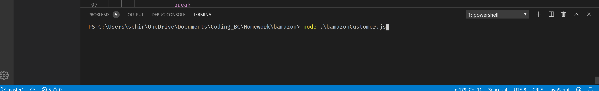

# Bamazon

## What it does
The bamazon app is an app that allows you to look up what is for sale and buy any quantity within bamazon's inventory. You can see what is for sale first and then it will ask you, which item you would like to buy and how many. If you order any quanity more than what the bamazon store has to offer, you will not be able to complete your order. However, if you do it will complete your purchase and give you the total cost of your order.

## Instructions on how to use Bamazon
First you must run the store by typing in the command line *"node bamazonCustomer.js"* 
By doing so you will be directed to the store in which you will be shown what items are available. After you see the items and know which you would like to buy, you will be asked 2 questions. The first is which item you would like to purchase and then it will ask you how many you would like to buy. If bamazon has enough to fulfill your order it will complete your purchase, notify you have completed it and give you your total price of your order. If Bamazon does not have enough quantity to fulfill your order then you will get a message saying Bamazon does not have enough and your order will not be completed. In order to purchase again you will have to run the node app again by typing in *"node bamazonCustomer.js"*  again. The steps to run it are shown below...

1. Type *"node bamazonCustomer.js"*  in the command line

2. You will see a list of item numbers, if you scroll up you will see the available items and you will see the item number, name, and price.

3. Once you know what you want to buy you will take the item number of the product you wish to buy and choose it from the list given.

4. After that it will ask how many you wish to buy and you enter a quantity of your choosing.

5. If the quantity you ask for is available Bamazon will complete your purchase and give you your total price

6. If however you choose a quantity that exceeds Bamazon's inventory then you will receive an insufficient quantity statement and how many of that item Bamazon has left

7. Once you are done you will be routed back to the beginning and in order to put in another order you will have to start from step 1 again.

## What I did to make this app work

So in order to make this app work I had to install to node packages. Inquirer and mysql2. I had to create a database in mysql and reference by using the mysql2 node package. I used inquirer to utilize prompts to ask the user a question. First thing I did was use mysql2 to show the table of products and what was available. After that I used a inquirer prompt to ask which item number they would like to buy and how many. After that I utilized a switch statement so that depending on their answer it would coincide with the item they chose. I also updated the table to represent how much quantity was left after they completed their purchase. 

## Challenges
I did not face too many challenges this assignment, but I did have a little trouble updating the table and dealing with asynchronization, but I was able to get past that using promises.
